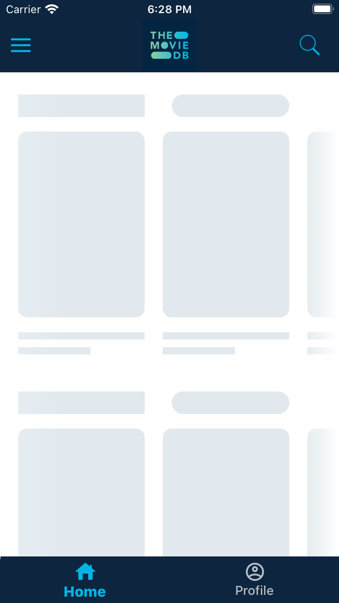
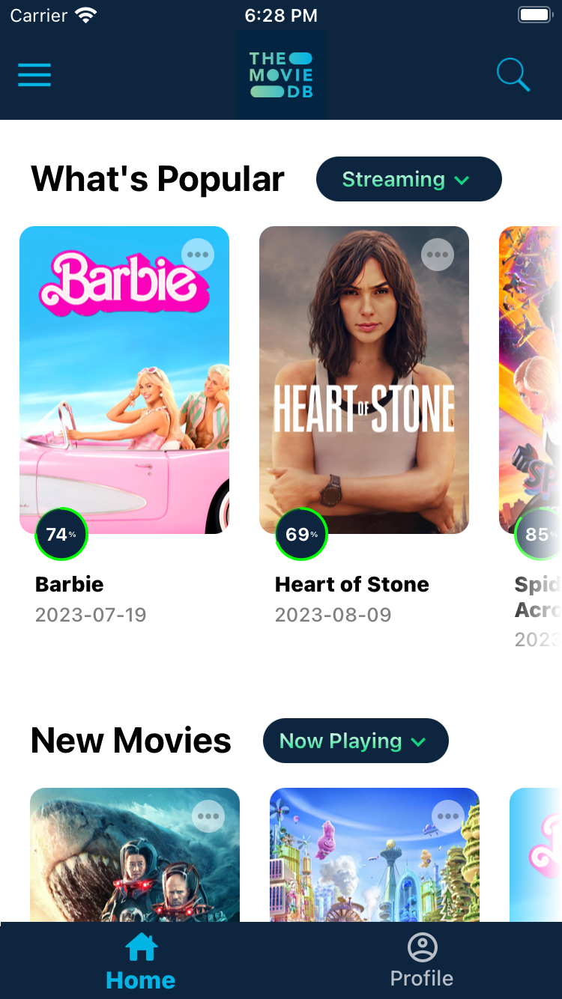
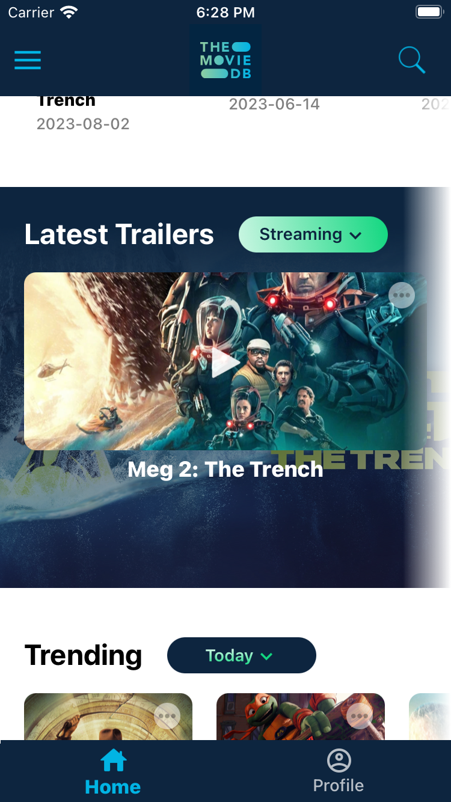
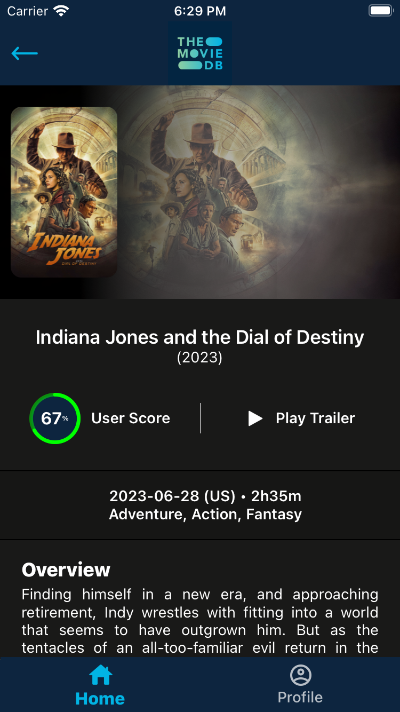

# rn-movieDB


[](https://choosealicense.com/licenses/mit/)


🎬 Welcome to rn-movieDB, your ultimate cross-platform movie application! 📽️ Explore the world of movies with the recreation of The Movie DB, delivering an immersive cinematic experience. Discover an array of features, including captivating 🔮 shimmer skeleton loading, 🔄 pull-to-refresh, 🔍 intelligent search module, 📡 real-time internet connectivity check, and 🎥 seamless trailer playback. Dive into the world of cinema and bring your favorite movies to life with rn-movieDB. Lights, camera, action! 🎬🍿


## Download

- Download the apk from [here](https://apkfab.com/moviedb/com.moviedb/apk?h=644ab6999ea53bca47e51b49cbef676cd76a305e4d563b13073c2d260fa89cde).


## Screenshots

<div style="display: flex; justify-content: center;">
  
        
    
    
</div>

<div style="display: flex; justify-content: center;">
  
        
    
    
</div>


## Features

- 🔄 Redux State Management
- 🔮 Shimmer Skeleton Loading
- 🔍 Global Search
- 📡 Real-time Internet Check
- 🎥 Seamless Trailer Playback
- 🌐 REST API Handling
- 🔄 Pull-to-Refresh


## Installation

Clone the project

```bash
  git clone https://github.com/rajat258/rn-movieDB.git
```

Install rn-movieDB with npm

```bash
  cd rn-movieDB
  npm i
```

#### Install bundle files

```bash
  bundle install
```

#### Note: Make sure your rvm version is 2.7.6

```bash
  rvm use 2.7.6
```

### iOS Installation:

```bash
  cd ios && pod install
```

### Android Installation:

No specific installation required for android.

### Start the server

```bash
  npm run start
```
## API Reference

API used for this project is [here](https://developer.themoviedb.org/docs/getting-started).


## Troubleshooting

##### Gradle build error in android:
- Open Android Studio
- Files > Sync files with project
- Build > Clean project
- Build > Rebuild project

## Color Reference

| Color              | Hex                                                              |
| ------------------ | ---------------------------------------------------------------- |
| Background Color      |  #ffffff |
| Primary Color |  #0d253f |
| Secondary Color    |  #12D780 |
| Accent 100 Color   |  #90CEA1 |
| Accent 200 Color   |  #01b4e4 |


## Authors

- [@rajat258](https://github.com/rajat258)

